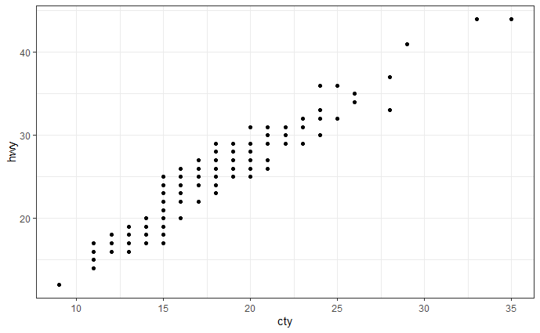
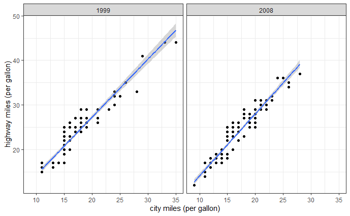
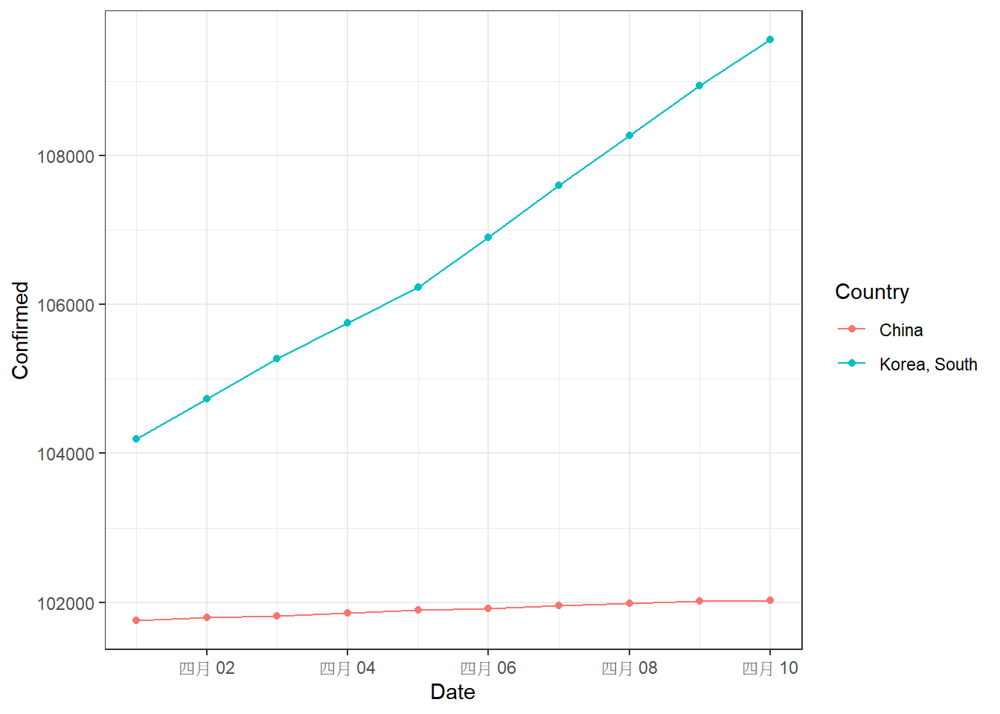
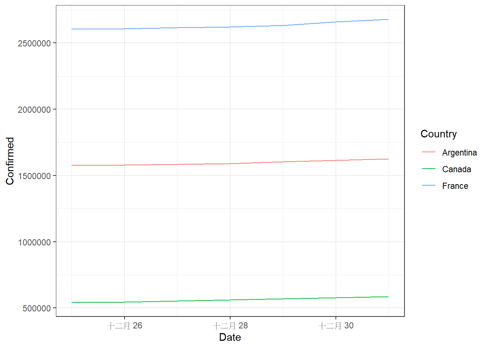
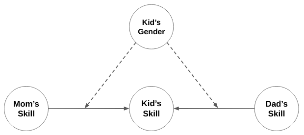

```{r setup, include=FALSE}
# 請勿更動此 code chunk 程式碼
knitr::opts_chunk$set(echo = TRUE, comment = '#>', error=TRUE, results = 'hold', out.width='70%', fig.align = 'center')

library(readr)
library(dplyr)
library(tibble)
library(ggplot2)
```

一、基本題 (共60 分)
=====================


檢視檔案 (10 分)
----------------

請處理 `lyrics/` 資料夾內的歌詞檔案，  
使用 `list.files()`：

1. 列出 13 個作者資料夾名稱，並將結果儲存在變數 `artists`
2. 列出 `lyrics/Lady Gaga` 之下所有的 `.txt` 檔 (需為**相對路徑**，相對於 `index.Rmd` 所在的資料夾)，並將結果儲存在變數 `songs`

```{r message=FALSE}
# Write your code here

#### Do not modify the code below ####
artists
tail(songs)
# Should print out:
#>  [1] "Ariana Grande" "Billie Eilish" "Cardi B"       "Charlie Puth" 
#>  [5] "Coldplay"      "Dua Lipa"      "Ed Sheeran"    "Katy Perry"   
#>  [9] "Khalid"        "Lady Gaga"     "Nicki Minaj"   "Post Malone"  
#> [13] "Taylor Swift" 
#> [1] "./lyrics/Lady Gaga/HOODIE.txt"           
#> [2] "./lyrics/Lady Gaga/I Like It Rough.txt"  
#> [3] "./lyrics/Lady Gaga/I Wanna Be With U.txt"
#> [4] "./lyrics/Lady Gaga/Imagine.txt"          
#> [5] "./lyrics/Lady Gaga/In Like With You.txt" 
#> [6] "./lyrics/Lady Gaga/Joanne.txt"
```


建立檔案目錄 (10 分)
--------------------

請建立一個 list (儲存在變數 `lyrics`)。`lyrics` 內總共有 13 個元素:

- 這 13 個元素的**名稱**分別是 `artists` 內的 13 位創作者姓名
- 每個元素皆是一個 character vector，
  儲存著創作者的歌曲的檔案路徑

提示：  
這題會使用到 `for` 迴圈或是 `lapply()`

```{r}
# Write your code here

#### Do not modify the code below ####
tail(lyrics[['Taylor Swift']], 3)
tail(lyrics[['Nicki Minaj']], 3)
tail(lyrics[['Ed Sheeran']], 3)
names(lyrics)
# Should print out:
#> [1] "./lyrics/Taylor Swift/You Need To Calm Down.txt"
#> [2] "./lyrics/Taylor Swift/Your Anything.txt"        
#> [3] "./lyrics/Taylor Swift/Your Face.txt"            
#> [1] "./lyrics/Nicki Minaj/Young Forever.txt"     
#> [2] "./lyrics/Nicki Minaj/Young Money Ballaz.txt"
#> [3] "./lyrics/Nicki Minaj/Your Love.txt"         
#> [1] "./lyrics/Ed Sheeran/You Need Me.txt"              
#> [2] "./lyrics/Ed Sheeran/You Need to Cut Your Hair.txt"
#> [3] "./lyrics/Ed Sheeran/You.txt"                      
#>  [1] "Ariana Grande" "Billie Eilish" "Cardi B"       "Charlie Puth" 
#>  [5] "Coldplay"      "Dua Lipa"      "Ed Sheeran"    "Katy Perry"   
#>  [9] "Khalid"        "Lady Gaga"     "Nicki Minaj"   "Post Malone"  
#> [13] "Taylor Swift"
```


dplyr-I  整理資料 (10 分)
-------------------------

你的任務是使用 `dplyr` 的函數整理 `anime.csv` 這份csv檔裡面的資料。

本題已為大家讀入 `anime.csv` 這份csv檔，並儲存到 `anime` 這個變數裡。

```{r message=FALSE, warning=FALSE}
# 讀入資料
anime <- read_csv('anime.csv')
#### Do not modify the code above ####
```

1. 請只保留「名稱」(`Name`)、「類型」(`Genders`)、「種類」(`Type`)、「來源」(`Source`)、「分數」(`Score`)和「受歡迎度」(`Popularity`)等6個變項。(3分)
1. `Genders`這個變項的名稱有誤，請改為`Genres`。(3分)
1. `Score`裡的值原本為一個浮點數，請將裡面的值四捨五入到整數。請新增一個欄位`Score_new`，並將更改過後的數值放進這個欄位中。(4分)  

完成後，將結果存回到 `anime` 這個變數裡。

```{r}
# Write your code here

#### Do not modify the code below ####
colnames(anime)
cat('\n\n')
anime[11:16, -2]

# Should print out:
#> [1] "Name"       "Genres"     "Type"       "Source"     "Score"     
#> [6] "Popularity" "Score_new" 
#> 
#> 
#> # A tibble: 6 x 6
#>   Name                Type  Source Score Popularity Score_new
#>   <chr>               <chr> <chr>  <dbl>      <dbl>     <dbl>
#> 1 Naruto              TV    Manga   7.91          8         8
#> 2 One Piece           TV    Manga   8.52         31         9
#> 3 Tennis no Ouji-sama TV    Manga   7.9        1039         8
#> 4 Ring ni Kakero 1    TV    Manga   6.38       7333         6
#> 5 School Rumble       TV    Manga   7.94        514         8
#> 6 Sunabouzu           TV    Manga   7.42       1284         7
```


dplyr-II 製作摘要表 (10分)
--------------------------

承上題，請製作一份摘要表，找出 `anime` 中，各個`Type`中`Popularity`最高的前三名，並以`Score`由大到小排序。

完成後，將結果儲存到 `anime_summary` 這個變數裡。

下方已使用 dplyr 函數完成部份的程式碼，但其順序是錯誤的。 請你修改下方程式碼 (改變函數順序，並在函數內填入適當的程式碼)，讓輸出的摘要表符合題目要求。

```{r}
# Write your code here
anime_summary <- anime %>%
  top_n() %>%
  filter() %>%
  arrange() %>%
  group_by() %>%
  select()

#### Do not modify the code below ####
head(anime_summary)

# Should print out:
#> # A tibble: 6 x 5
#> # Groups:   Type [2]
#>    Name                                      Type    Source     Score Popularity
#>    <chr>                                     <chr>   <chr>      <dbl>      <dbl>
#>  1 Fullmetal Alchemist: Brotherhood          TV      Manga       9.19          3
#>  2 Sen to Chihiro no Kamikakushi             Movie   Original    8.83         41
#>  3 Mononoke Hime                             Movie   Original    8.72         91
#>  4 Howl no Ugoku Shiro                       Movie   Novel       8.67         98
#>  5 Death Note                                TV      Manga       8.63          1
#>  6 Shingeki no Kyojin                        TV      Manga       8.48          2
```


Grammar of Graphics (10 分)
---------------------------

`ggplot2` 中的 `gg` 指的是 **Grammar of Graphics**，旨在透過一套**語法**去描述繪圖的過程。
基於這個理念的設計下，`ggplot2` 的繪圖函數都有一套固定的結構 (模板)。要繪製不同的圖片，只需將必要的東西填入模板當中的 "slot" 即可。

你的任務是使用內建資料 `mpg` 繪製出散布圖。散布圖的 x 軸為 `cty` (city miles per gallon，城市駕駛油耗)，y 軸為 `hwy` (highway miles per gallon，高速公路駕駛油耗) ，其輸出之後應和下圖一樣：
{.half style="width:58%"}

```{r}
library(ggplot2)
theme_set(theme_bw())

# Write your code here
```


Tweak the plot (10 分)
----------------------

為了讓圖表顯示更多資訊，請依下列條件修改散布圖：

1. 請依據年份，在同一個 ggplot 畫布上分成兩個散布圖 (3 分)
1. 請繪製 `cty` 和 `hwy` 的線性回歸線 (3 分)
1. 請將 x 軸標題改為 `city miles (per gallon)`；y 軸標題改為 `highway miles (per gallon)` (4 分)

{.half style="width:58%"}


```{r}
# Write your code here
```


二、進階題 (共40 分)
=====================


Data Wrangling and Visualizing  (20 分)
---------------------------------------

請使用 `covid19_confirmed` 這份 csv 檔，將資料整理好，並寫一個可繪製任意多國於任意時段之確診案例數比較圖的 function 。


### Tidy up the data (5分)

本題已為大家讀入 `covid19_confirmed` 這份 csv 檔，並儲存到 `confirmed` 這個變數裡。請你觀察 `confirmed` 的格式，會發現它是一個以「省份」 (`Province`)、「國家」 (`Country`) 和「每日日期」  (`1/22/20`、`1/23/20`、...、`4/18/21`)  為欄位名稱的寬表格。

```{r message=FALSE}
# 讀入資料
#### Do not modify the code below ####
confirmed <- read_csv("./covid19_confirmed.csv")
```

1. 請保留「省份」 (`Province`) 和「國家」 (`Country`) 這兩個欄位不變動，將它轉為 **tidy** 的長表格(即符合**每個橫列代表一個觀察值且每個直欄代表一個變數**的形式)，以 `Date` 和 `Confirmed`  為變數(欄位)名稱整理各國各省份不同日期的確診人數。*提示：你可能會需要用到 `tidyr` 這個套件。*
1. 請將整理好的資料儲存到 `tidydf` 這個變數裡。

```{r}
# Write your code here

#### Do not modify the code below ####
tidydf
# Should print out:
#> # A tibble: 124,122 x 4
#>    Province                     Country             Date    Confirmed
#>    <chr>                        <chr>               <chr>       <dbl>
#>  1 <NA>                         Afghanistan         1/22/20         0
#>  2 <NA>                         Albania             1/22/20         0
#>  3 <NA>                         Algeria             1/22/20         0
#>  4 <NA>                         Andorra             1/22/20         0
#>  5 <NA>                         Angola              1/22/20         0
#>  6 <NA>                         Antigua and Barbuda 1/22/20         0
#>  7 <NA>                         Argentina           1/22/20         0
#>  8 <NA>                         Armenia             1/22/20         0
#>  9 Australian Capital Territory Australia           1/22/20         0
#> 10 New South Wales              Australia           1/22/20         0
#> # ... with 124,112 more rows
```


### Make a summary table (5分)

請使用 `as.Date` 這個函數將 `Date` 欄位的資料型態從 `<chr>` 轉為 `<date>` *(若不熟悉這個函數，可使用 `?as.Date` 查看說明)*，並整理出各國不分省份從 2020/1/22 至 2021/4/18 的每日總確診人數摘要表，並儲存到 `tidysum` 這個變數裡。

```{r}
# Write your code here

#### Do not modify the code below ####
tidysum %>% filter(Country %in% c("Canada", "United Kingdom"), Confirmed > 1000000)
# Should print out:
#> # A tibble: 186 x 3
#>    Country Date       Confirmed
#>    <chr>   <date>         <dbl>
#>  1 Canada  2021-04-03   1005296
#>  2 Canada  2021-04-04   1008808
#>  3 Canada  2021-04-05   1017130
#>  4 Canada  2021-04-06   1027854
#>  5 Canada  2021-04-07   1035242
#>  6 Canada  2021-04-08   1043478
#>  7 Canada  2021-04-09   1052560
#>  8 Canada  2021-04-10   1060052
#>  9 Canada  2021-04-11   1067764
#> 10 Canada  2021-04-12   1078482
#> # ... with 176 more rows
```


如果你真的不知道如何做答上面這兩題，助教已將 2.1.2 應輸出的結果存成 `agiftforyou.csv`[^src]，請在下方程式碼區塊讀入檔案，並命名為 `tidysum` ，接著還是可以繼續完成 2.1.3 。

注意：但若你有寫前兩題，只不過對自己寫出來的答案沒信心，還是選擇讀入 `agiftforyou.csv`，**前面兩題** (2.1.1 和 2.1.2) 都會**以零分計算**。

[^src]: 若需要請自行至 <https://rlads2021.github.io/deps/agiftforyou.csv> 下載檔案

```{r}
# If you need the gift, please read the data in this chunk

```


### Visualizing selected data (10分)

請你完成 `compare_plot` 這個 function ，它的功能是畫出不同國家在特定期間確診數的折線圖。以下為這個 function 的 5 個引數與其說明：

1. `df`：讓使用者可輸入想使用的資料。資料型態為 data frame 。
1. `countries`：讓使用者可輸入想比較的國家，其長度可大於或等於 1。
1. `start`：起始日期(含)。輸入格式為 `yyyy-mm-dd` 的字串。
1. `end`：終止日期(含)。輸入格式為 `yyyy-mm-dd` 的字串。
1. `point`：讓使用者可選擇是否在折線圖上標示資料點。預設為 `FALSE` 。

```{r}
# Modify the code below
compare_plot <- function(df, countries, start, end, point) {
  
}

```

<div style="background-color: #cefdce; border-radius: 5px; padding: 20px;" >
- 參考輸出結果依序應如下。 *(X軸的標示為中文、英文或數字不影響評分)*

{.half}

{.half}
</div>

```{r}
#### Do not modify the code below ####
# Should be like Figure. covid_a
compare_plot(tidysum, c("China", "Korea, South"), "2021-04-01", "2021-04-10", TRUE)

#### Do not modify the code below ####
# Should be like Figure. covid_b
compare_plot(tidysum, c("Canada", "Argentina", "France"), "2020-12-25", "2020-12-31")
```


Simulating Data (20 分)
-----------------------

```{r echo=F}

```

請依據上方的因果結構模擬出資料。在這題中，總共有 4 個變項：

- `mom` (Mom's Skill): 母親的廚藝
- `dad` (Dad's Skill): 父親的廚藝
- `kid` (Kid's Skill): 孩子的廚藝
- `gender` (Kid's Gender): 孩子的性別

在這個因果結構中，我們假定孩子的廚藝受到父親以及母親廚藝的影響。除此之外，我們還做了一個額外的假設：

> 若孩子為男性，其廚藝受父親影響較大；反之，若孩子為女性，其廚藝受母親影響較大。

請根據上圖模擬出這 4 個變項的資料，並將結果儲存成一個 data frame `df`：

1. 請模擬出 500 筆觀察值
2. 假定 `mom`, `dad` 與 `kid` 皆來自常態分配
    - `mom` 與 `dad` 來自標準常態分配 (平均 = 0, 標準差 = 1)
    - `kid` 來自標準差 = 1 的常態分配
3. 假定 `gender` 來自伯努利分配 $f(x) = p^x (1 - p)^{1-x}$，其中：
    - $x = 1$ 代表男性；$x = 0$ 代表女性。參數 `p` 為男性的機率，為 `0.55`，下方的程式碼已幫同學們模擬好 `gender`。
    - 關於伯努利分配：  
      伯努利分配是一種離散型機率分布，其值僅有兩種可能：`1` 或 `0`，可用來模擬一些只有兩種結果的現象 (例如，擲一次硬幣出現正面或反面)。伯努利分配只有一個參數 `p` 用以決定事件出現的機率 (例如，硬幣擲出正面 (`1`) 的機率)。
      在 base R 裡面，可以透過二項分配 (`rbinom()`) 去模擬伯努利分配，因為二項分配即是 `n` 個獨立的伯努利試驗結果的加總。換言之，當 `n` 等於 `1` 時，二項分配即是一個伯努利分配。例如，若想從一個 `p = 0.7` 的伯努利分配去抽取出 3 個樣本，可以使用：
      
      ```{r}
      rbinom(n = 3, size = 1, prob = 0.7)
      ```
      因為 `p = 0.7` 的伯努利分配相當於 `n = 1` (由 `rbinom()` 裡的 `size` 設置)、`p = 0.7` (由 `rbinom()` 裡的 `prob` 設置) 的二項分配。
4. 假定「`mom` 對 `kid`」與「`dad` 對 `kid`」的因果影響皆為正向的，但影響的強度會依據孩子的性別 (`gender`) 改變：
    - 當孩子的性別為男性時，  
      `mom` 對 `kid` 的影響強度 (係數) 為 `1.0`；`dad` 對 `kid` 的影響強度 (係數) 為 `1.5`
    - 當孩子的性別為女性時，  
      `mom` 對 `kid` 的影響強度 (係數) 為 `1.5`；`dad` 對 `kid` 的影響強度 (係數) 為 `1.0`


```{r}
set.seed(190)
#### Do not modify the code above ####

N <- 500
gender <- rbinom(N, size = 1, prob = 0.55)  # Bernoulli,  1: male,  0: female
# Write your code here

#### Do not modify the code below ####
tail(df, 10)
summary(df)
# Should print out:
#>             dad        mom gender        kid
#> 491  0.39742373 -3.1746860      1 -3.6361269
#> 492  0.05349804  0.1558408      1 -0.8539515
#> 493  0.36071734  0.1115669      1  0.8258999
#> 494  0.94195740  1.0810747      0  3.1703803
#> 495  0.39592784 -0.8354654      0 -2.0449140
#> 496  0.91671870  0.1557979      1  1.0999368
#> 497  0.14715859  0.7863578      0  0.2715137
#> 498 -0.56556242  0.6051137      1 -0.2888568
#> 499 -0.13921002  3.0161313      1  3.0278126
#> 500 -0.03405183 -0.3603594      1  0.8489946
#>       dad                 mom               gender           kid         
#>  Min.   :-2.843564   Min.   :-3.17469   Min.   :0.000   Min.   :-6.0272  
#>  1st Qu.:-0.654175   1st Qu.:-0.57318   1st Qu.:0.000   1st Qu.:-1.2959  
#>  Median :-0.020412   Median : 0.09085   Median :1.000   Median : 0.0912  
#>  Mean   : 0.008413   Mean   : 0.08744   Mean   :0.512   Mean   : 0.1638  
#>  3rd Qu.: 0.709016   3rd Qu.: 0.77380   3rd Qu.:1.000   3rd Qu.: 1.6481  
#>  Max.   : 2.772793   Max.   : 3.09273   Max.   :1.000   Max.   : 6.2474
```
